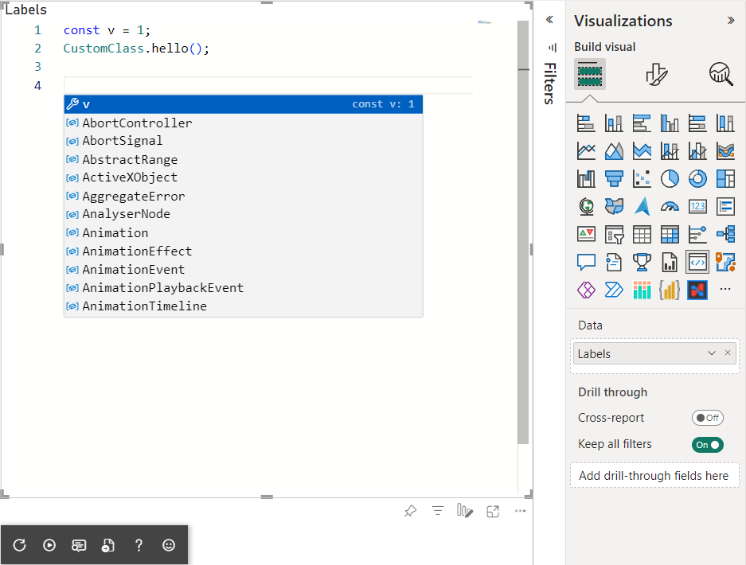

# The example visual with integrated monaco editor

The project contains three parts:

The first part is monaco editor bundle with entry point at `src\monaco\reexport.ts`. The `webpack.monaco.config.js` uses to bundle the editor and export as library.

The secod part is monaco editor workers for TypeScript, CSS, HTML, JSON. The `webpack.monaco.config.js` uses to bundle the workers and export as plain JS to load source into worker as inline text. The `webpack.monaco-workers.config.js` config uses to bundle workers.

The third part is visual. There is nothing spectial. It's typical visual for Power BI.

